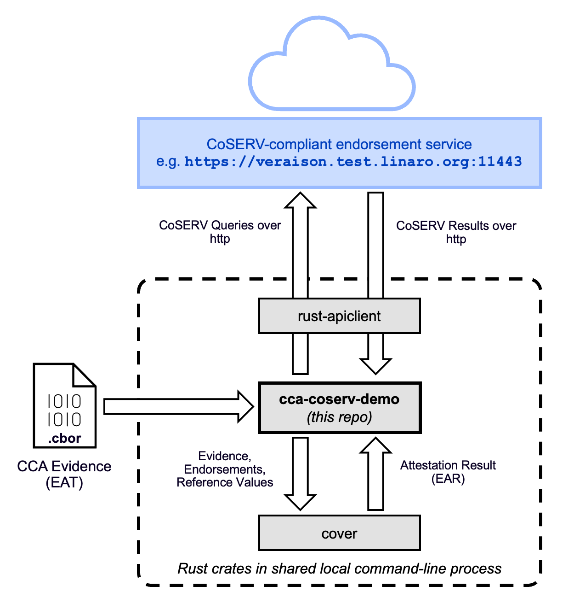

# CCA CoSERV Demo

This project demonstrates how to use the [CoRIM Verifier (cover)](https://github.com/veraison/cover) to verify and appraise an Arm CCA attestation token, using [CoSERV](https://datatracker.ietf.org/doc/draft-ietf-rats-coserv/) as the source of trust anchors and reference values.

## Purpose

The purpose of this demo is to show, using Arm CCA as an example, how attestation evidence can be verified and appraised locally, which means without the use of an external verification service.

In terms of the [RATS architecture (RFC9334)](https://datatracker.ietf.org/doc/rfc9334/) for remote attestation, this demo exemplifies the case where the implementation of the Verifier role is combined directly with the implementation of another role, such as the Attester or the Relying Party.
This is instead of having the Verifier role being implemented in a remote service, where it would be accessed via a call over the network.

When verification is performed locally in this way, the Verifier still needs access to a trusted and up-to-date source of endorsements and reference values from the supply chain.
This demo showcases an emerging draft standard known as the [Concise Selector for Endorsements and Reference Values (CoSERV)](https://datatracker.ietf.org/doc/draft-ietf-rats-coserv/), which is being developed within the [IETF RATS Working Group](https://datatracker.ietf.org/wg/rats/about/).
CoSERV provides a way for Verifiers to query one or more supply chain sources using a single common protocol.
It addresses the fragmentation problems that arise as an increasing number of vendors need to make these kinds of materials available to the software ecosystem.

In this demo, a remote service is still used, but it is not a verification service.
The remote service is an endorsement and reference value provider service, which uses CoSERV as the interface.

The code in this demo repo does not implement the verification or appraisal logic.
Instead, this logic is borrowed from the [`cover`](https://github.com/veraison/cover) Rust crate.
This is possible because CoSERV is very close to CoRIM, and inherits much of CoRIM's data model, most importantly for the endorsement and reference value triples.
This re-use of the data model means that CoRIM's verification algorithm, which `cover` implements, is directly usable with CoSERV data, with just a small layer of adaptation.

What this demo provides is an end-to-end orchestration of the entire process of retrieving trusted endorsements and reference values from the remote service using CoSERV APIs, storing them in local memory, and calling the verification function in `cover` to obtain and display an attestation result.

The CCA attestation token is passed into this tool as a command-line argument.
In future developments, this tool may support obtaining the CCA attestation evidence directly from a running realm, but this is not possible right now.

## Comparison with `rust-ccatoken`

The [`rust-ccatoken`](https://github.com/veraison/rust-ccatoken) repo also includes logic and command-line tooling for the local verification and appraisal of Arm CCA attestation evidence, and therefore has some functionality in common with this demo.

There are very important differences, though:-

- The `rust-ccatoken` library has its own verification algorithm, and uses manually-provisioned endorsements and reference values in a custom (JSON-based) file format.
It does not use CoSERV or `cover`, which are exactly the two technologies that this demo is showcasing.

- This demo is exclusively dedicated to verification and appraisal of evidence, whereas the tools in `rust-ccatoken` have additional capabilities such as inspection and goldenization of CCA evidence.

This demo makes use of the `rust-ccatoken` crate when parsing the CCA evidence in order to formulate the required CoSERV queries.

## Software Architecture

A summary of the software architecture for this demo is given in the figure below.

<p align="center">
  
</p>

The diagram is simplified down to the most essential interactions and data flows. Additional Rust crates are also used, including the [`coserv-rs`](https://github.com/veraison/coserv-rs) and [`corim-rs`](https://github.com/veraison/corim-rs) crates for the parsing and manipulation of CoSERV and CoRIM data.

Because this demo uses CoSERV to retrieve endorsements and reference values, there is a dependency on a CoSERV-capable endorsement service.
This demo does not run any such service automatically.
There is an experimental service available at `https://veraison.test.linaro.org:11443`.
Alternatively, you can create your own deployment of the Veraison services or use a different CoSERV-compliant service for Arm CCA.
The service that you want to use should be passed into the tool as a command-line parameter (see instructions below).

## How to Build
This is a Rust project so you need to [install Rust](https://rust-lang.org/tools/install/) first.

Then simply build as follows:

```
cargo build
```

## Installation and Usage

Install by running this command from the repo root:

```bash
cargo install --path . --locked
```

Example usage:

```bash
ccacoserv-cli --evidence test/ccatoken.cbor --coserv-server https://veraison.test.linaro.org:11443 --pretty
```

To see a list of available commands, run:

```bash
ccacoserv-cli --help
```
